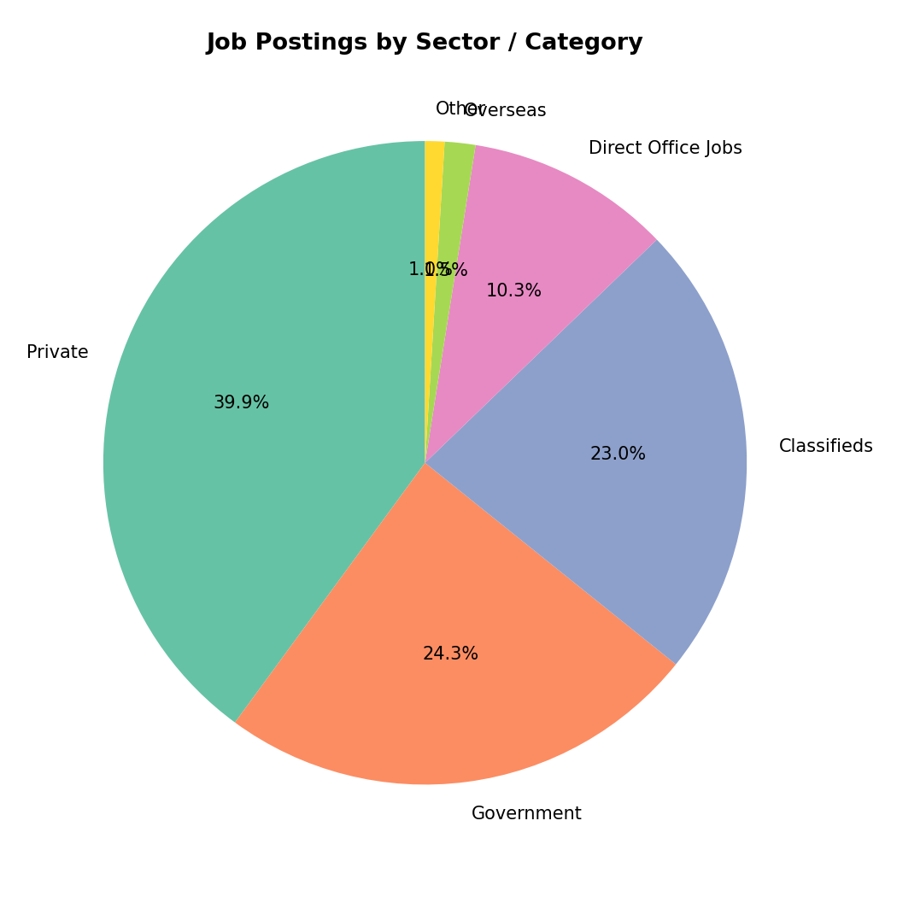
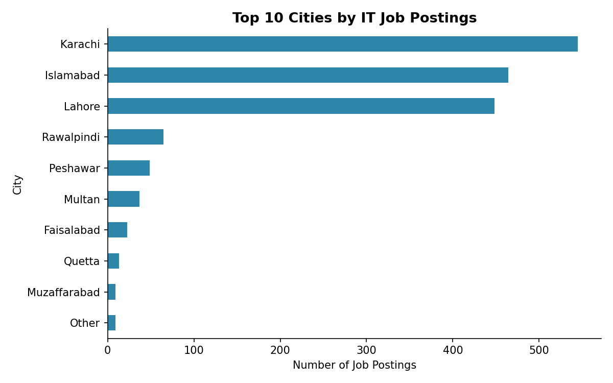
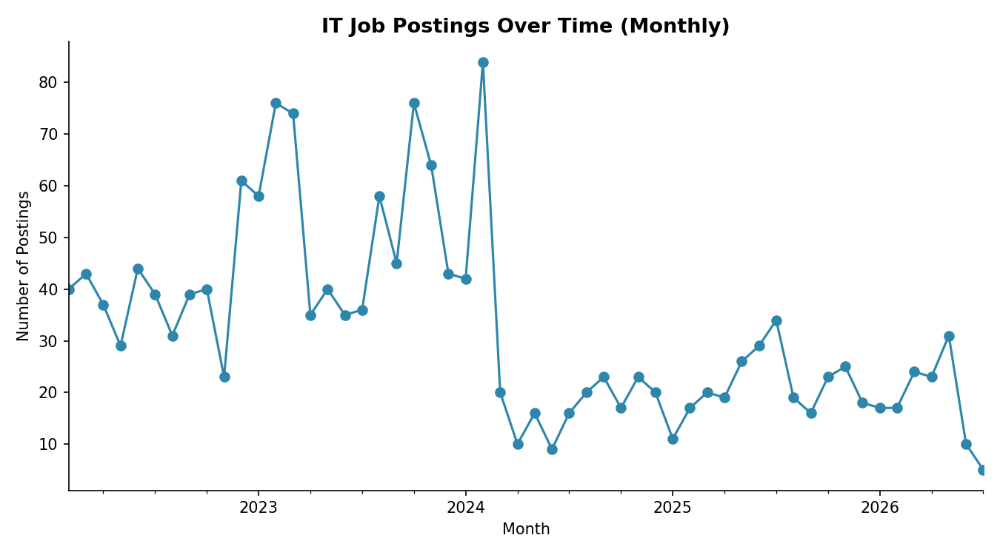
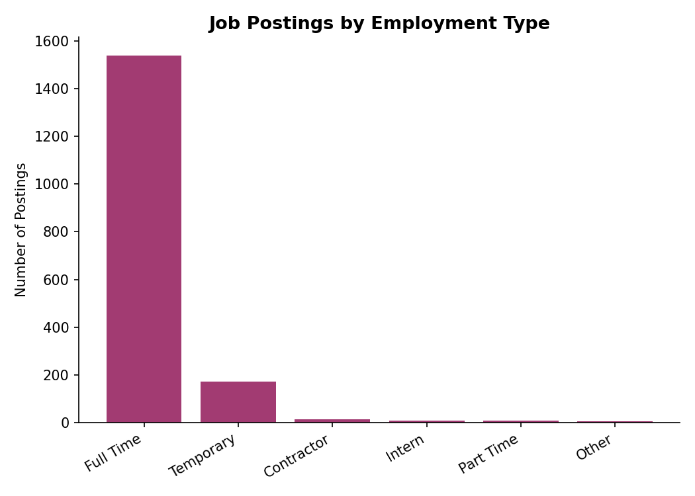
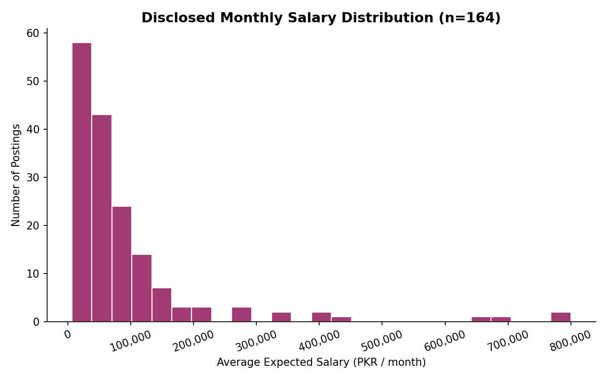

# IT Jobs Market Analysis (Pakistan) 🇵🇰

An end-to-end data project that scrapes, cleans, and analyzes IT job postings from [jobz.pk](https://www.jobz.pk) to uncover hiring trends across Pakistan's IT industry.



## 📌 Project Overview

This project covers the full data pipeline:

1. **Scraping** — collected 1,750+ IT job postings using Selenium & BeautifulSoup
2. **Cleaning** — handled messy dates, salary ranges, experience text, and missing values with pandas
3. **Feature Engineering** — derived posting month/year, application window length, min. experience, salary min/max/avg
4. **Exploratory Analysis & Visualization** — built 8 charts to surface hiring trends
5. **Insights** — summarized key findings on cities, sectors, salary transparency, and education requirements

## 🛠️ Tech Stack

- **Python** — pandas, numpy, matplotlib
- **Web Scraping** — Selenium, BeautifulSoup
- **Data Formats** — CSV, Excel

## 📂 Repository Structure

```
project/
├── clean_data.py                          # Data cleaning & feature engineering script
├── make_charts.py                         # Visualization generation script
├── cleaning.ipynb                         # Exploratory cleaning notebook
├── jobs.py                                # Job listing scraper (Selenium)
├── scraping/
│   └── scrapDataByVistingLinksUsingBeautifulSoup.py   # Detail-page scraper (BeautifulSoup)
├── data/
│   ├── raw/                               # Original scraped data
│   │   └── IT_Related_Jobs_Visiting_Links1.csv
│   └── processed/                         # Cleaned, analysis-ready data
│       ├── IT_Jobs_Cleaned.csv
│       └── IT_Jobs_Cleaned.xlsx
├── visuals/                               # Generated chart images
├── INSIGHTS.md                            # Full write-up of findings
└── README.md
```

## 🚀 How to Run

```bash
# 1. Clone the repo
git clone https://github.com/yourusername/your-repo.git
cd your-repo/project

# 2. Install dependencies
pip install pandas numpy matplotlib openpyxl

# 3. Run the cleaning pipeline
python clean_data.py

# 4. Generate the visualizations
python make_charts.py
```

Cleaned data will be written to `data/processed/` and charts to `visuals/`.

## 📊 Key Insights

- **Karachi, Islamabad, and Lahore** account for ~85% of all IT job postings
- **Private sector leads hiring** (~40%), followed by Government (~24%) and Classifieds-style listings (~23%)
- **Full-Time roles dominate** (~88%) — internships and part-time postings are rare
- **Bachelor/Master combinations** are required in 60%+ of postings
- Only **~9% of postings disclose salary**; where stated, the median is **~51,250 PKR/month**
- Only **~44% disclose experience requirements**; where stated, **2 years** is the most common minimum
- The **median application window is just 15 days**

📄 See [INSIGHTS.md](INSIGHTS.md) for the full analysis write-up.

## 📈 Sample Visualizations

| Top Cities | Monthly Trend |
|---|---|
|  |  |

| Job Type | Salary Distribution |
|---|---|
|  |  |

## 📄 License

This project is for educational/portfolio purposes. Job data was scraped from publicly available listings on jobz.pk.